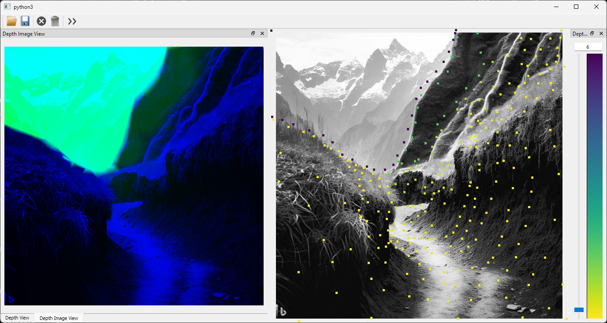
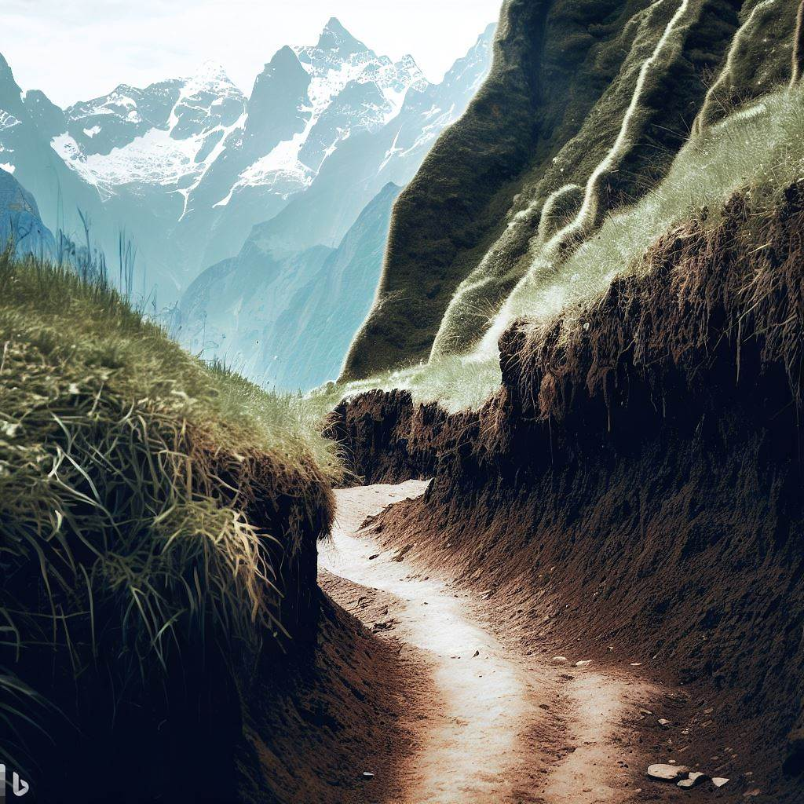
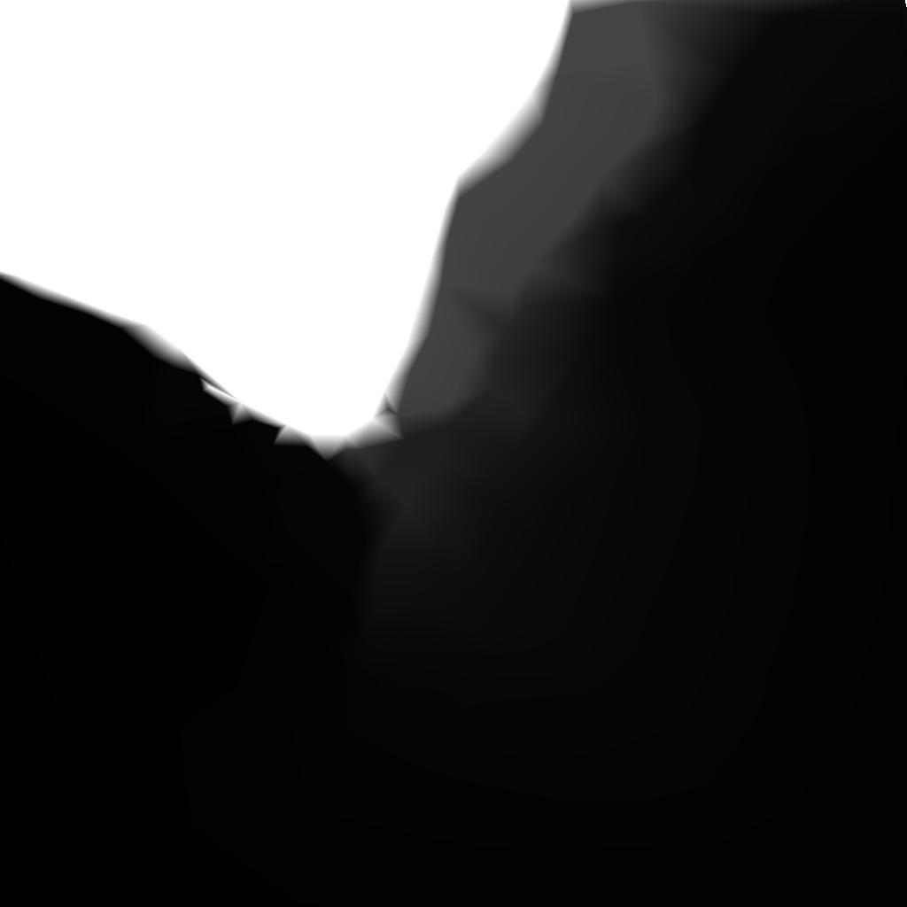
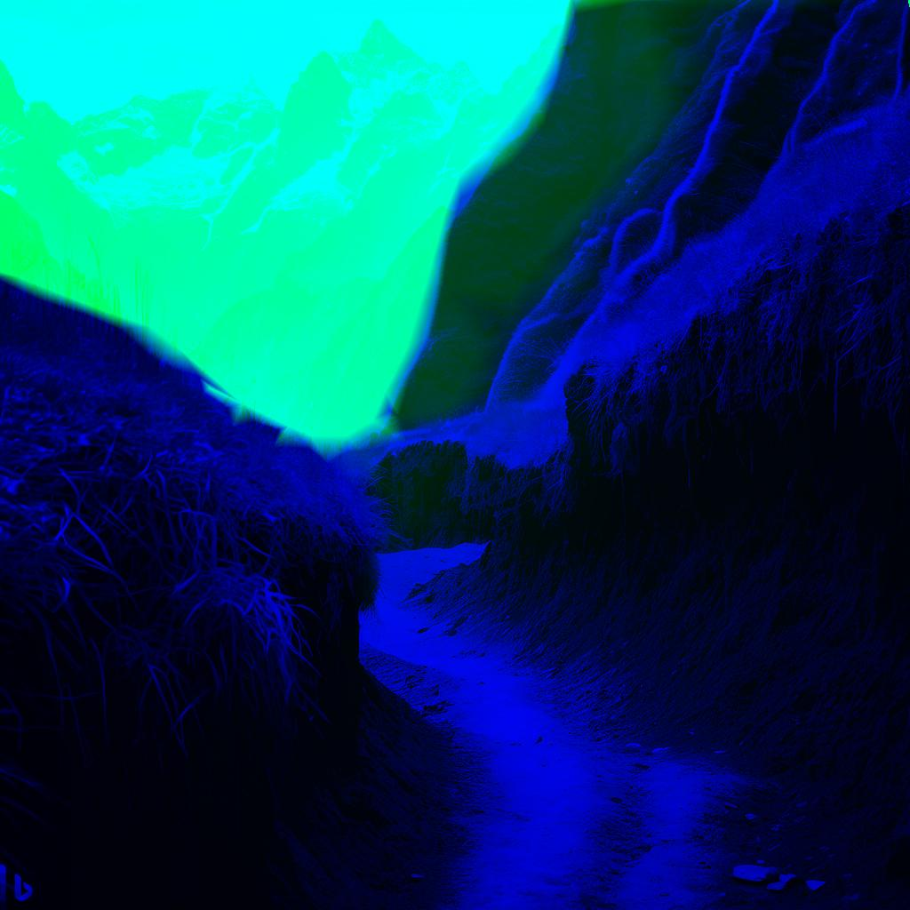

# Depthify

The following is a small app enabling the addtion of a 'depth' channel to a grayscale image. 
A few points are manually added, and the rest of the image is interpolated (with more or less sucess, depending on the points chosen). 


## Preview

|  |
| --- | 
| GUI for manually adding points |

|  |  |  |
| --- | --- | --- |
| original image | interpolated depth map, created by user | output (blue channel is grayscaled image, green channel is depth map) |


## Running

After installation, the project can be run as module: 
```bash
python -m depthify
```

## Acknowledgements 😄 
This app was co-developped by [ChatGPT](https://chat.openai.com/). 

The images were provided by Microsoft Bing's [Image Creator](https://www.bing.com/create?). 
